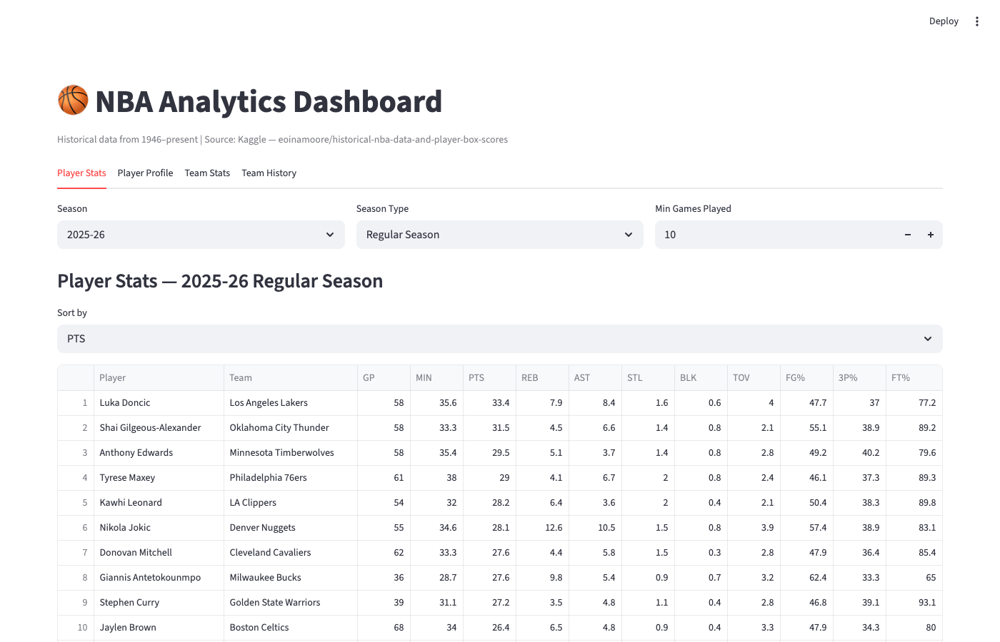
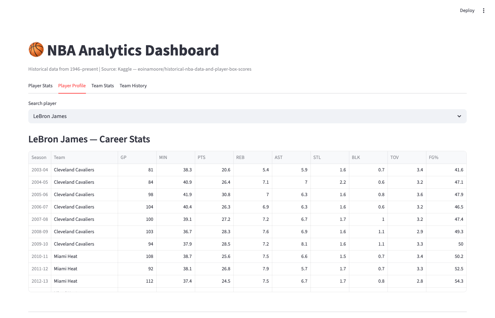
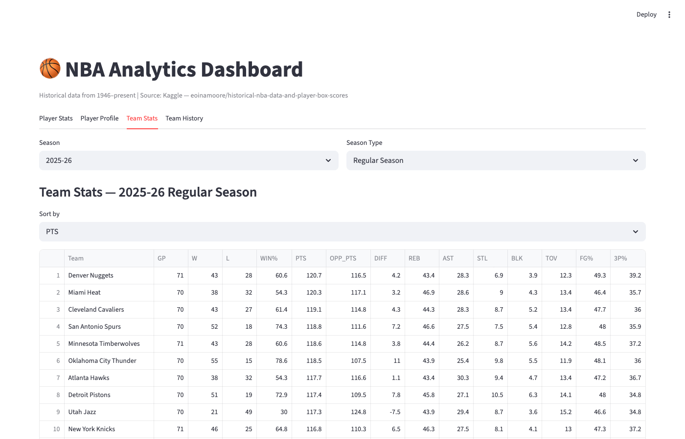
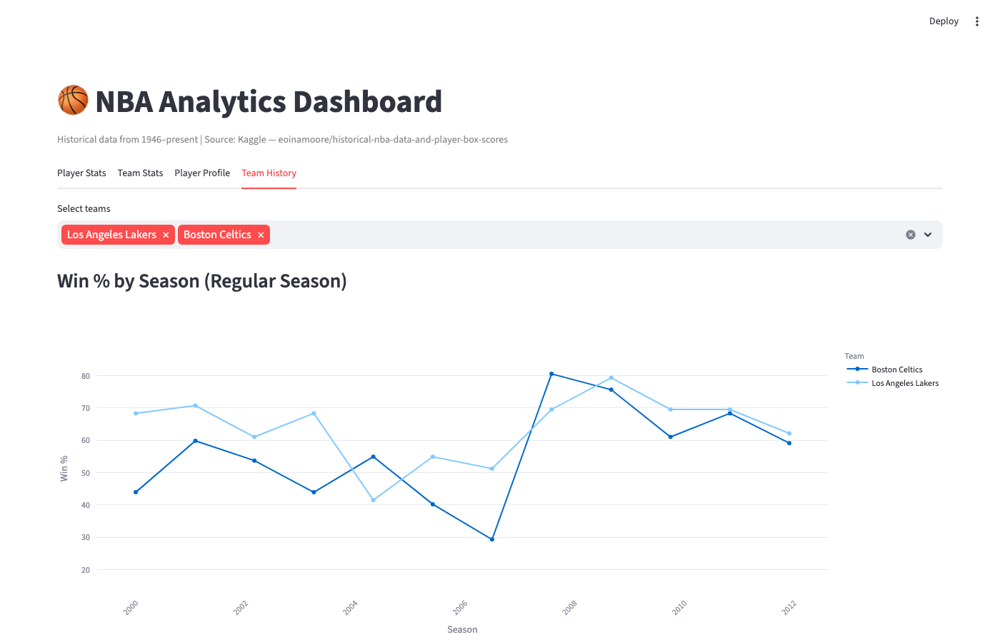

# NBA Analytics Dashboard









An interactive analytics dashboard for exploring historical NBA data from 1946 to present, built with Streamlit and Plotly — inspired by [nba.com/stats](https://www.nba.com/stats).

## Features

| Tab | Description |
|-----|-------------|
| **Player Stats** | Per-game averages leaderboard (PTS, REB, AST, STL, BLK, FG%, etc.) with season and game type filters |
| **Player Profile** | Career season-by-season stats table and trend line chart for any player |
| **Team Stats** | Team W-L records, scoring averages, and an offensive vs defensive rating scatter plot |
| **Team History** | Win % trend lines across seasons for multiple teams, plus a per-game log for any team and season |

## Data

Sourced from the Kaggle dataset [eoinamoore/historical-nba-data-and-player-box-scores](https://www.kaggle.com/datasets/eoinamoore/historical-nba-data-and-player-box-scores), downloaded automatically via `kagglehub`.

Covers over 1.6 million player box scores across Regular Season, Playoffs, Play-in Tournament, and more.

## Setup

Requires Python 3.13+ and [uv](https://docs.astral.sh/uv/).

```bash
# Install dependencies
uv sync

# Run the dashboard
uv run streamlit run app.py
```

Then open [http://localhost:8501](http://localhost:8501) in your browser.

> **Note:** A Kaggle account and API token are required for the first run to download the dataset. Follow the [kagglehub setup guide](https://github.com/Kaggle/kagglehub) to configure credentials.
